# Mapping Misery
Jonathan Barnes
2024-12-11

# Introduction

Health metrics often highlight improvements in physical and mental
outcomes over time or often prioritize on life expectancy to outline
success. However, these broad measures can obscure a critical reality:
many individuals are not just living longer—they are experiencing more
days of poor health and suffering. For those burdened by physical
limitations, chronic illness, mental health challenges, or realizing
your own brain is destroying itself, each additional year can represent
an increase in cumulative physical and emotional strain rather than an
improvement in quality of life.

Beyond simply adding years, disparities in health outcomes mean some
individuals endure disproportionately higher levels of pain, stress, and
poor health conditions over their lifetimes. These disparities are not
evenly distributed; they are influenced by socioeconomic status, access
to healthcare, and other structural inequities such as location as well
as historical and current political influence. This results in a
troubling pattern where the lived experience of health diverges sharply
from the abstract gains reflected in numbers. Quantifying this burden is
essential to understanding the human impact of poor physical and mental
health days. By analyzing patterns in the data, we can move beyond
surface-level improvements to identify and address the underlying
drivers of suffering, ensuring that efforts to improve public health
translate into both longer and better lives for all individuals.

# Data

Data was obtained from [County health rankings & Roadmaps operated by
the University of Wisconsin’s Population Health
Institute](https://www.countyhealthrankings.org/health-data/methodology-and-sources/data-documentation).
This project used the publicly available data for release years 2023 and
2024, as well as trend records since 1997.

Because the presence of two separate years splitting was limited, and
instead 2023 was treated as the test year, with 2024 as the training
year. Based on documentation not every measure is for 2023 or 2024 but
instead are lagged. For example, 2023 contains the 2020 metrics of poor
mental and physical health days while 2024 has 2021.

Outcome variables were then mean centered when producing the models to
better observe relative variation in days as opposed to strictly
predicting the absolute number. When producing the final regression
model multiple imputation using the classification and regression tree
(cart) method was utilized and the data was split 50/50 to reduce
potential overfitting.

## Pre-Preprocessing and Clustering Methods

Before looking to predict poor physical and mental health days, I wanted
to determine a method to implement historical trends for each county,
state, and the country overall. These trends contained metrics in
premature death, uninsured adults, primary care physicians, preventable
hospital stays, unemployment rate, children in poverty, sexually
transmitted infections, mammography
screening, uninsured, dentists, uninsured children, air pollution –
particulate matter, alcohol-impaired driving deaths, flu vaccinations,
and school funding starting in 1997 always up to 2022. For my purposes I
filtered out trends before 2008. I then imputed missing values with the
mean of those 14 years for the specific county and measure. For school
funding, Vermont’s counties were set to be the average Vermont spent as
they fund schools as a state, and not by county. Additional metrics
created included: yearly difference between state and country for each
metric; average variability over the 14 years for county and state;
average difference between state and country; and the coefficient of
variance. All for each of the 15 original measures for all years and
ranges between 2008 and 2022.

The last required component (foreshadowing) for allowing these trends to
contribute effectively to the model was dimension reduction. In total I
had 634 variables across 3196 observations (Country, 52 States, 3143
counties). The initial choice was to conduct a PCA with GMM clustering,
setting NAs as their own group. The second choice was to instead conduct
an MCA by turning all 634 variables into categories with 7 levels and an
additional 8th to represent NA’s and again using GMM clustering.
Objectively I believe PCA worked more effectively but using MCA
permitted using missing values as an explanatory feature.

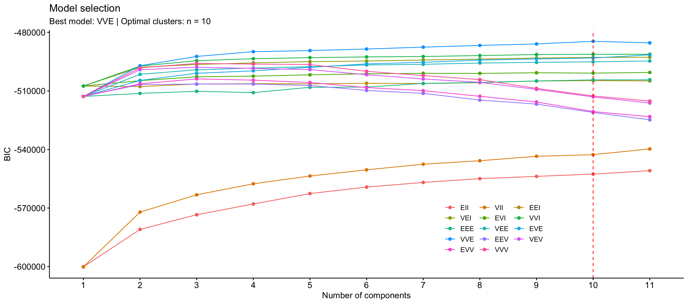

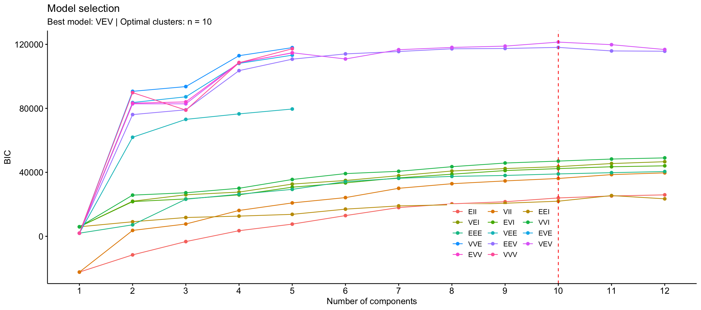

*Map 1: Behold the new US regions* 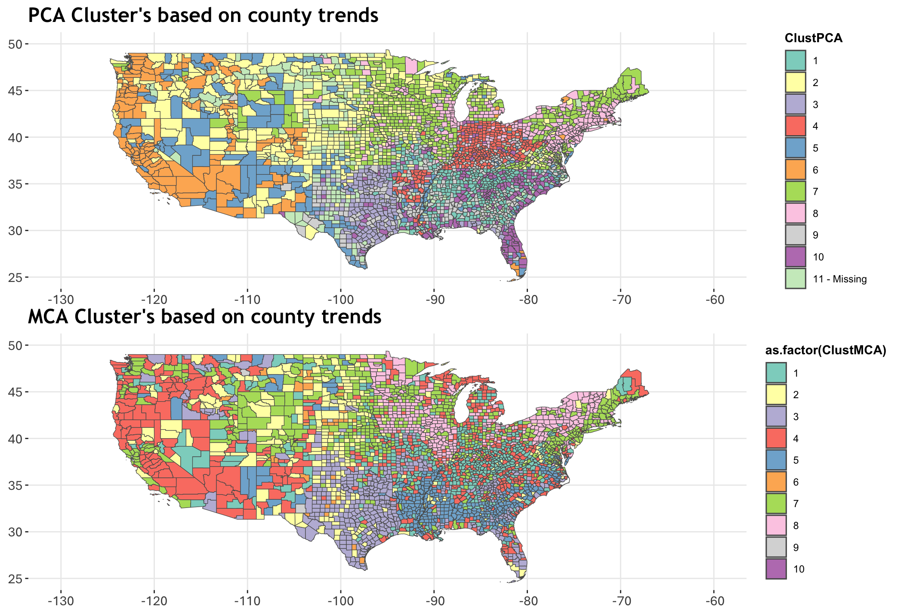

## Demographics and Cluster Outcomes

As outlined above, while PCA is more effective and efficient I cared
more about using missingness as a feature. This almost exclusively
because it can speak to available resources to report measures. Clusters
from here on refer to GMM clusters of the MCA.

Seen below is Table and the base demographic trends by cluster with an
overall column for comparison:

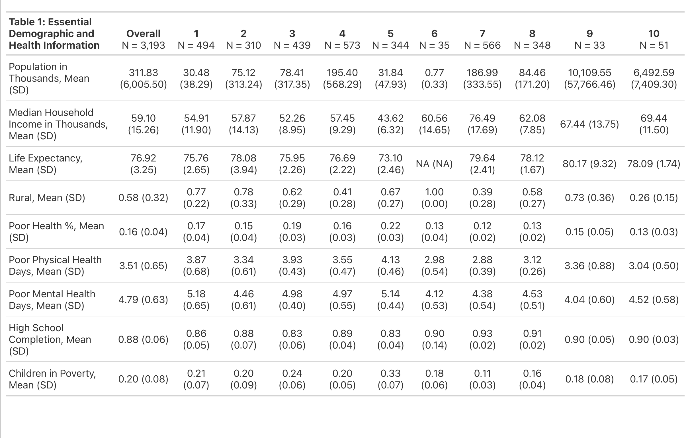

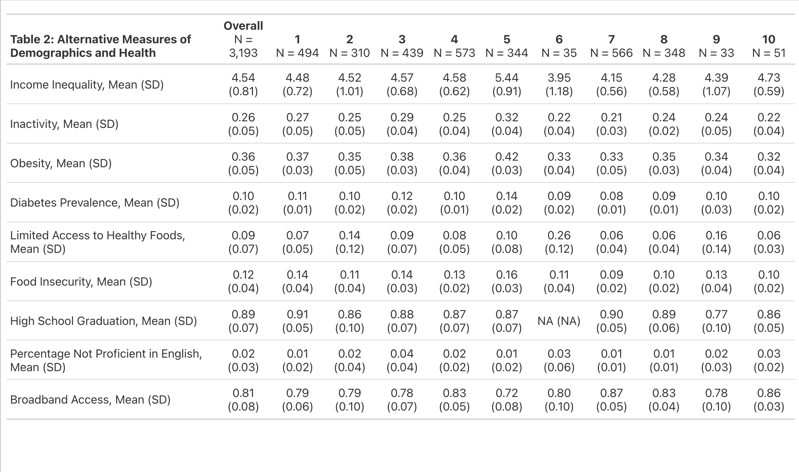

Without diving in specific to each cluster I wanted to highlight some
numbers or oddities. Of the 10 clusters, only 3 contain less than 100.
Interestingly, one of these is 100% rural, and the ninth cluster, which
was assigned to the United States as a whole, largely consists of all
Alaskan counties. For purposes of what I’m trying to predict, the
overall number of poor physical health days per 30 days is 3.5 with
cluster 7 being the lowest at 2.88 and cluster 5 highest at 4.13. For
poor mental health days America averages 4.79 days per 30 with cluster
one being the higher at 5.2 closely followed by cluster 5 at 5.1;
cluster 9 and cluster 6 have the two lowest at 4 and 4.1 respectively.
It’s very fitting the cluster with America and the most Rural cluster
have the lowest.

When observing the maps below, we see the counties representing the
southern united states all fall in clusters with higher poor physical
health days per 30. This is s similar trend for mental health days
however this is less defined and proven harder to explain.

*Map 2: A higher number or movement away from blue represents number of
expected days above the center mean.*

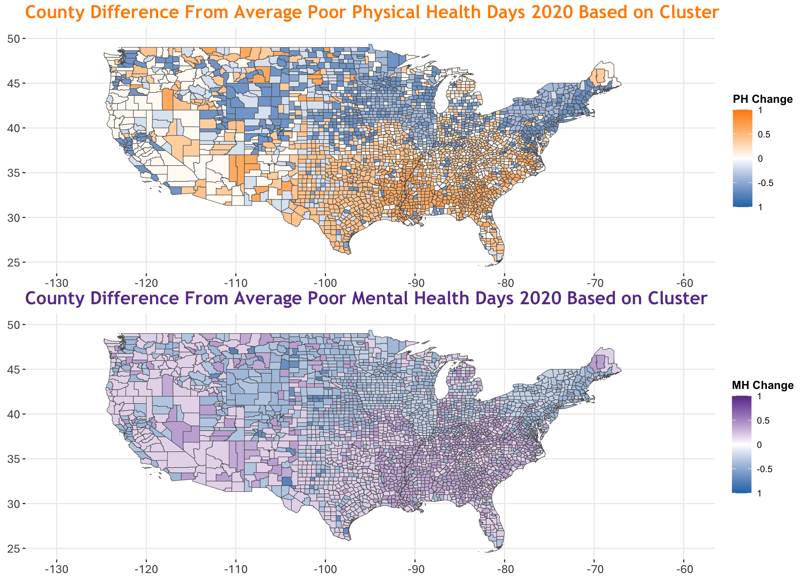

# Model Methods

When building or creating anything I prefer using iterative systems,
going from simple, complex, then optimized. That showed here with the
first model being the single cluster predictor, the second being a MLR
with over 20 predictors, and then using hybrid L1/L2 regularization
elastic net regression for the final model. The hybrid ridge lasso
approach was selected due to multicellularity being prevalent among
predictors while still wanting it to remove or penalize unneeded or less
impact predictors.

All models were evaluated numerically by comparing the RMSE, MAE, and
R-Squared. Aside from initial component or correspondence analyses and
the multiple imputation as required for the final models input matrix,
clustering and tree-based methods were limited due to the continuous
outcome.

Model two was almost exclusively fit to determine a high-end expectation
of RMSE and R-Squared as a benchmark for the L1/L2 and not particularly
relevant for prediction outcome purposes.

Following evaluation of the final model I specifically examined all
residual values to determine where the model prediction was missing, by
how much, and if it was missing while still estimating in the proper
direction. I examined by state, cluster, and for direction to see if
when it missed in the wrong direction it was always large. Those plots
can be seen towards the bottom of this document.

# Results

The first model consisting of just the single cluster predictor
performed quite well considering it was a single 10 level predictor. It
was particularly effective in predicting poor physical health days,
achieving an R-squared of 0.43, with an RMSE of 0.49 and MAE of 0.38.
Given that the data for poor physical health days ranged from
approximately -1.6 to 3, these error values are notable for a single
predictor model. However, its explanatory power was less effective for
mental health days, where the R-squared dropped to 0.29, with an RMSE of
0.52 and MAE of 0.4. For mental health days, the data range was roughly
-2 to 2, making these metrics less optimal but still impressive for a
model based on only ten categories. A table and plot with the expected
changes for each cluster are provided on the next page. Note that the
evaluation metrics reported there reflect the model’s fit to the given
data rather than its predictive ability.

The second model performed significantly better but was also
substantially more complex and intentionally overfit for benchmarking
purposes, rendering it non-generalizable. This model included the
cluster variable alongside a large number of predictors, including birth
weight, adult smoking, obesity, food environment, inactivity, access to
exercise, mental health provider availability, high school completion,
children in poverty, income inequality, children in single-parent
households, social associations, driving alone to work, life expectancy,
diabetes prevalence, food insecurity, limited access to healthy foods,
insufficient sleep, high school graduation, median household income,
homeownership, broadband access, population, percentage not proficient
in English, and the rural index.

With these predictors, the model for poor physical health days achieved
an R-squared of 0.842 and an RSE of 0.259. For mental health days, the
model improved to an R-squared of 0.661 and an RSE of 0.343. Although
RSE and RMSE are distinct metrics, with 3,200 observations, their values
are nearly identical (since n ≈ n−p).

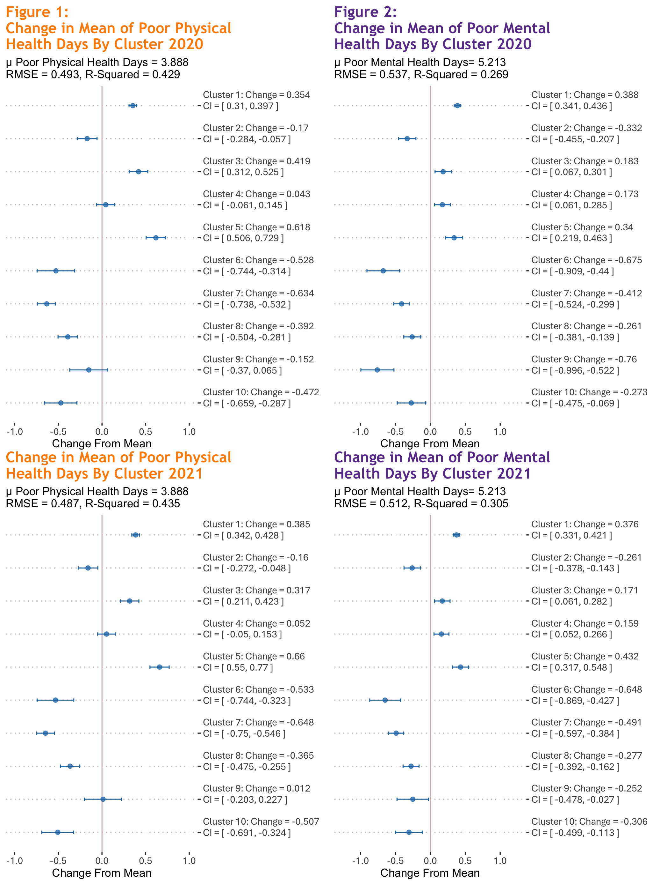

The final model was an L1/L2 regularization elastic net regression
model, or a hybrid lasso and ridge regression. An acceptable and optimal
lambda value was determined to be 0.02 after completing a 25-fold cross
validation. To ensure proper responses and a proper input matrix the
single county in Texas which didn’t report poor physical, or mental
health days was removed, and the input matrix was filled using the
classification and regression tree (CART) method to impute. CART was
used specifically because no other setting worked given the structure
and nature of the data.

Following the determination of lambda with cross validation, the model
was trained using 50% of the original data from the 2023 release. This
was done primarily to prevent overfitting as aside from the single two
prior counties removed, we have responses from the whole population of
US counties.

This final model for poor physical health days achieved a R-Squared of
0.844 with a RMSE of 0.263 and MAE of 0.208. The model for poor mental
health days continued the trend of less success with an R-Squared of
0.645 with 0.375 and 0.295 for RMSE and MAE respectively.

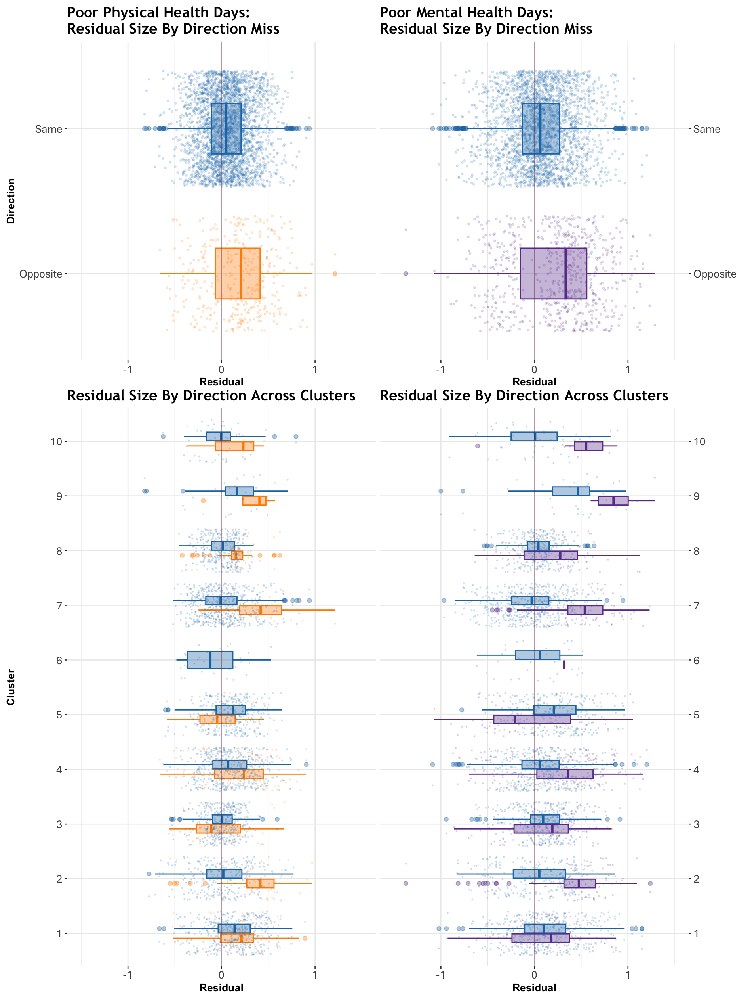

Map 3: L1/L2 Elastic Net Regression Residuals.

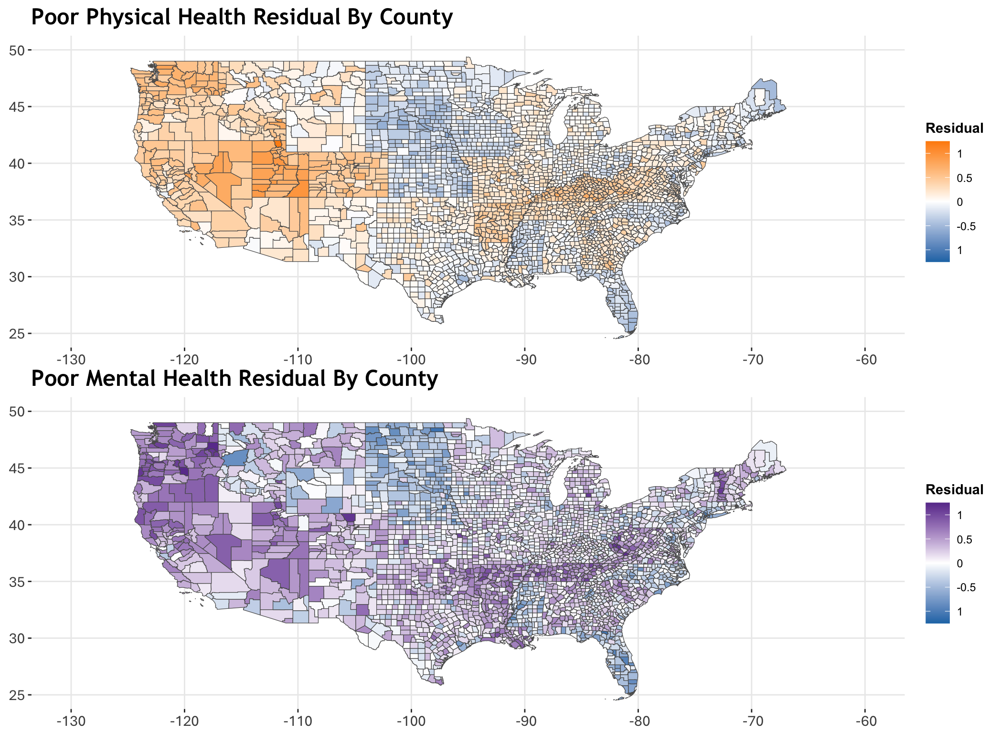

# Discussion

## Alternative approaches

After successfully having the MCA work in clustering counties I would
find it interesting to convert all of the numerical metrics to
categories, allowing for NAs as a group. I normal settings I think it
wouldn’t be as impactful but when thinking about counties it can reflect
political influence, beliefs, or lack of resources. I’m also looking to
play around with one-hot encoding on a mass scale and using component
analysis in a similar fashion to MCA to see how efficient it could be.

## Limitations

I didn’t adjust for state like I was originally planning too and when
looking at the residual map some appear very clearly on state lines. I
hoped the clustering would address some of that but not properly. The
other thing is mental health again just proves hard to predict, but
physical ailment is extremely viable.

When I looked at the residuals my concern was not so much if it was
missing, but if it was missing in the right direction. This means if the
expected difference from the center mean is negative (less), then it was
predicting a negative number. I found that several counties, largely on
the west coast, were proving more difficult to predict. The reason I
care about the direction is because I plan to make the outcomes into
indicators to see if I can predict risk next.

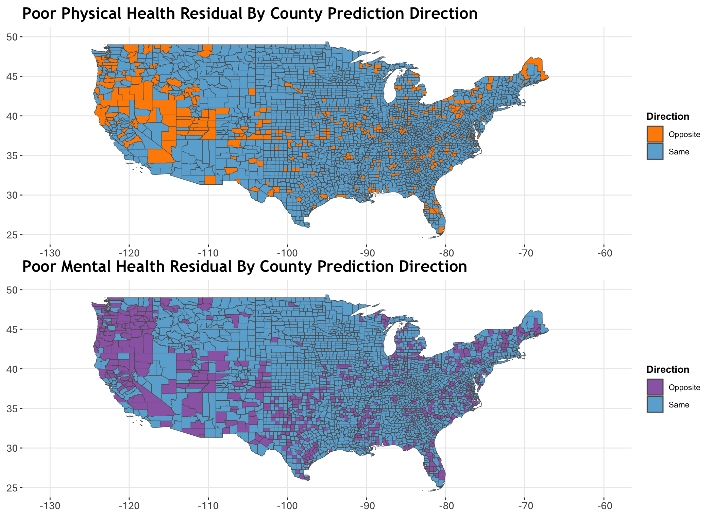

# Other Plots

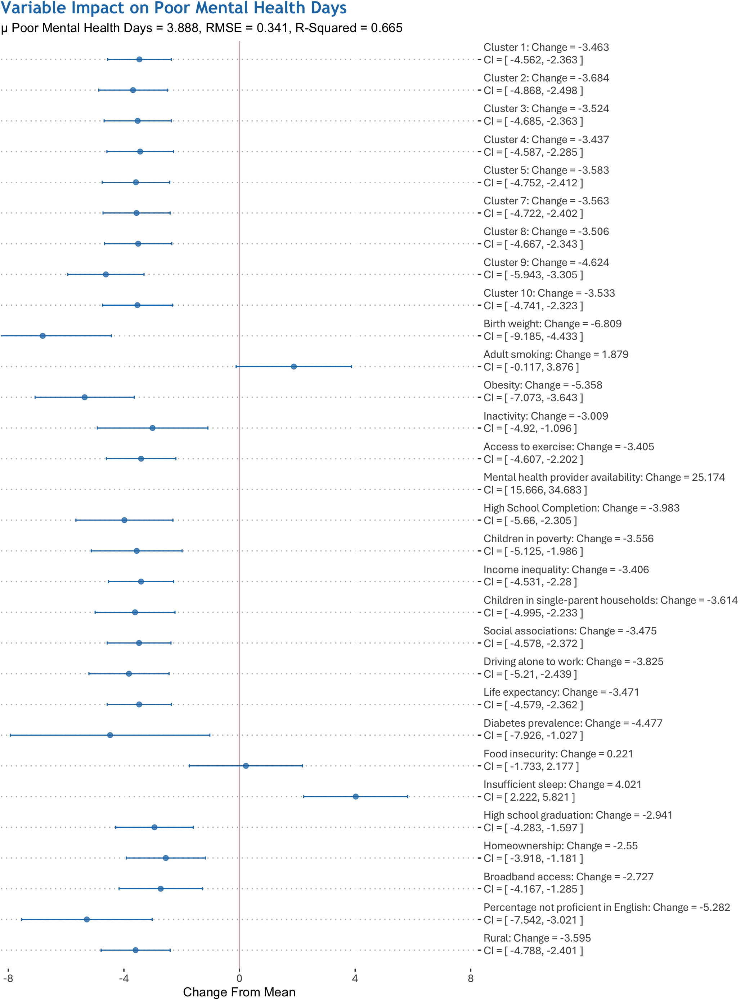

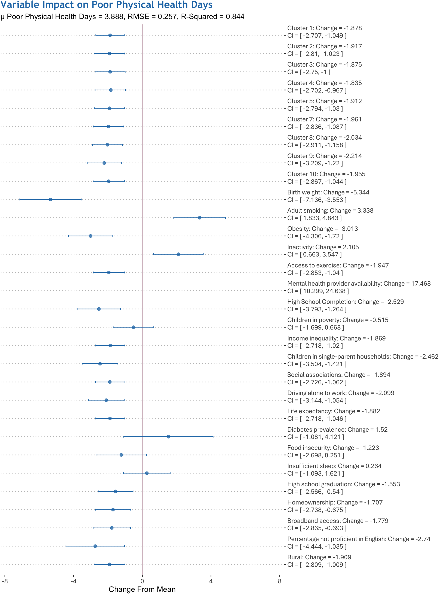

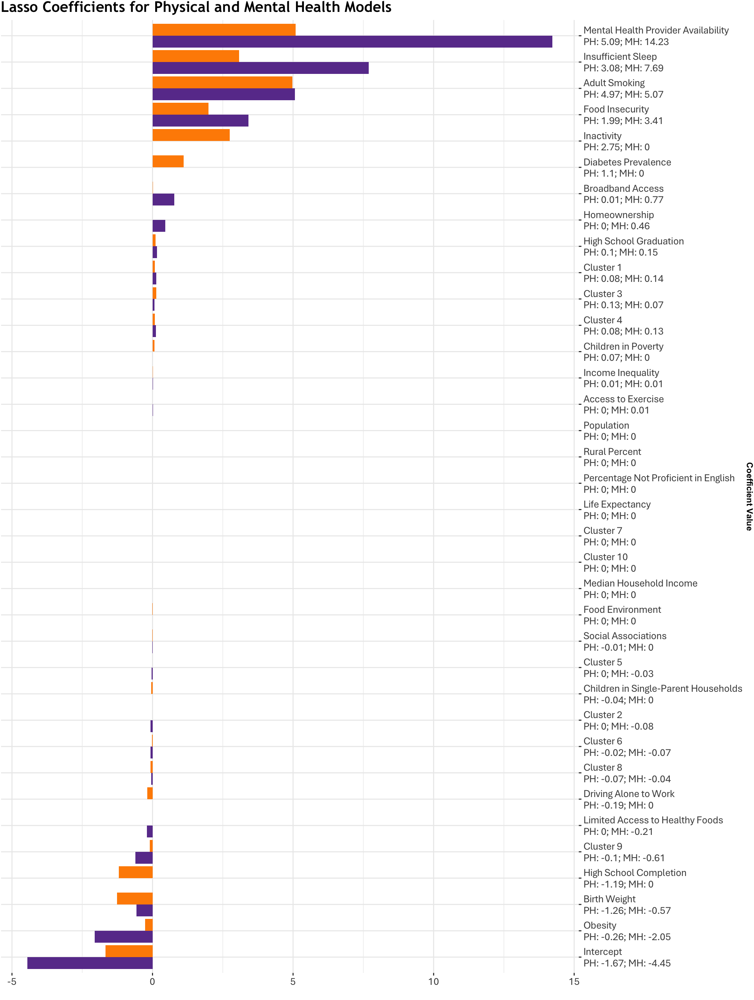

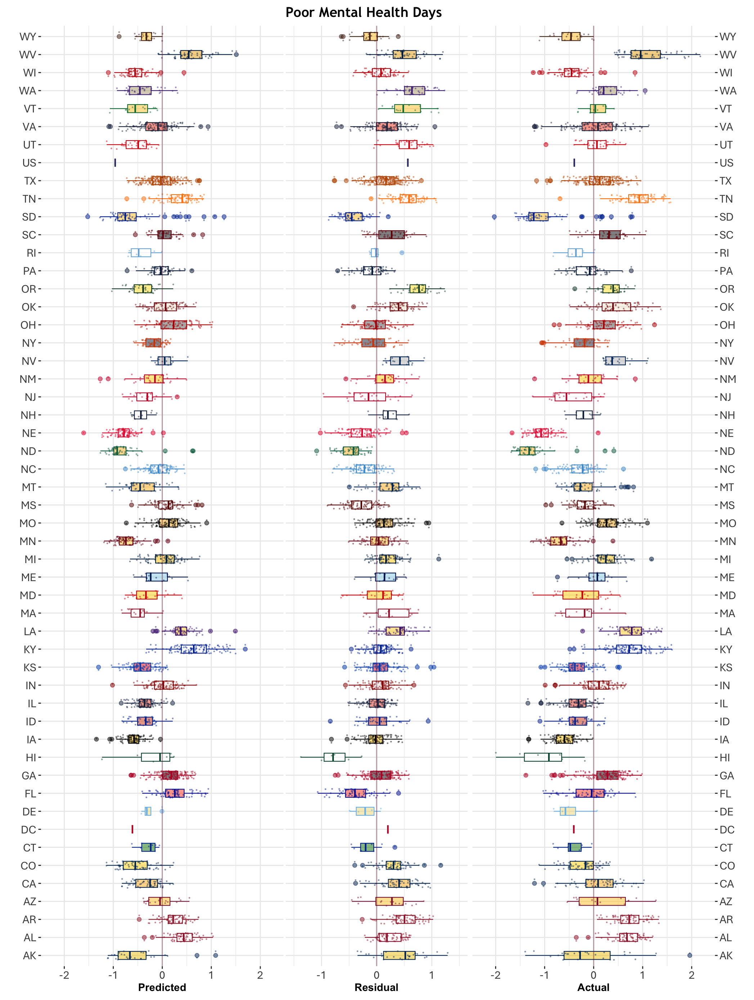

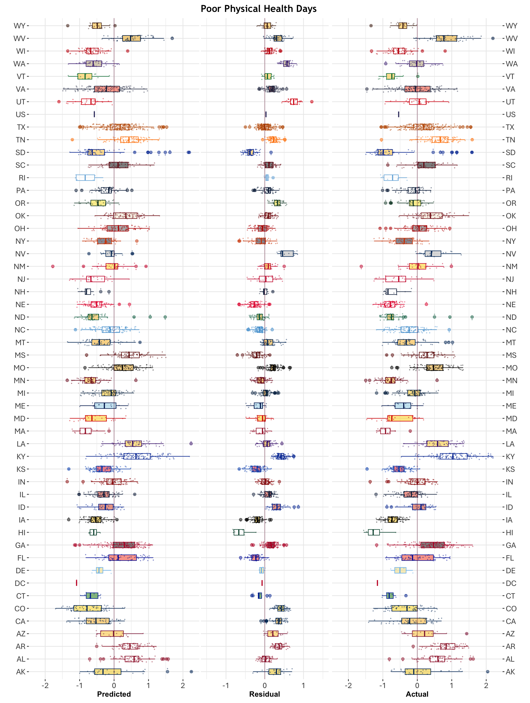
